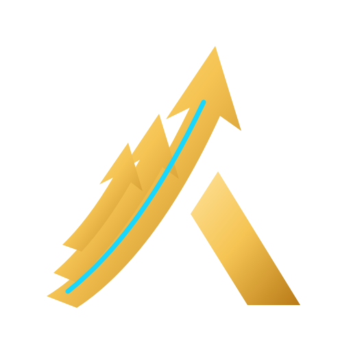

<div align="center">



# AurumOS

**Orquestrador multi-estratégia de trading quantitativo — 100% paper trading, dado real, sem mock.**


</div>

---

## O que é

AurumOS é um orquestrador de trading que roda **9 estratégias independentes em paralelo**, cada uma lendo dado real de mercado (Bybit, Bitget, Ethereum on-chain, SEC EDGAR, Alpaca/IEX), competindo por um orçamento de risco comum através de um motor central de decisão. Nada aqui é simulado ou sintético: os preços, spreads, liquidações, filings e transações on-chain são reais — apenas a execução é em paper trading, sem dinheiro de verdade conectado.

O objetivo não é uma única estratégia "vencedora", e sim um **sistema que decide sozinho onde alocar risco** entre oportunidades de naturezas completamente diferentes — desde arbitragem de milissegundos até eventos macro que acontecem uma vez por mês — usando o mesmo motor de risco, o mesmo sizing e o mesmo kill-switch para todas.

> Regra permanente do projeto: **nunca conecta capital real, nunca cria contas em nome do usuário**, independentemente de qualquer autonomia concedida. Todo o histórico de operações abaixo é paper trading.

---

## Arquitetura

```
                        ┌─────────────────────────────────────────┐
                        │            9 SignalSource                │
                        │  (cada um lê dado real, emite            │
                        │   Opportunity num canal async comum)     │
                        └───────────────────┬───────────────────────┘
                                             │ mpsc::Sender<Opportunity>
                                             ▼
                        ┌─────────────────────────────────────────┐
                        │   Orquestrador (orchestrator.rs)          │
                        │   • motor de confluência (fusion.rs)      │
                        │   • scorer por velocidade/edge             │
                        │   • concorrência por orçamento de risco    │
                        └───────────────────┬───────────────────────┘
                                             │
                        ┌────────────────────┴────────────────────┐
                        ▼                                          ▼
        ┌───────────────────────────┐            ┌───────────────────────────┐
        │  Motor de risco (risk.rs)  │            │  EventBus (events.rs)     │
        │  • Kelly hierárquico        │            │  • backlog + replay ao     │
        │  • kill-switch em 4 camadas │            │    vivo via WebSocket      │
        │  • escalonamento por        │            │  • persistido em JSONL     │
        │    estratégia/símbolo       │            └─────────────┬─────────────┘
        └─────────────────────────────┘                          ▼
                                                    ┌───────────────────────────┐
                                                    │  Dashboard (axum)          │
                                                    │  http://127.0.0.1:7878     │
                                                    └───────────────────────────┘
```

Cada módulo implementa o mesmo contrato (`trait SignalSource` em [`sources/mod.rs`](orchestrator/src/sources/mod.rs)): lê dado real, emite `Opportunity`, nunca decide sozinho se executa. Toda decisão de execução, sizing e corte por risco passa por um único motor central — isso é o que permite comparar uma oportunidade de arbitragem de 3 segundos com um sinal de whale watch que dura horas usando a mesma régua.

---

## As 9 estratégias

| Estratégia | Fonte de dado | O que captura |
|---|---|---|
| **Arbitragem** | Book Bybit ↔ Bitget (spot) | Divergência de preço executável entre exchanges |
| **Order Flow** | Book Bybit (spot) | Captura de spread como market maker |
| **Pump Exhaustion** | Funding + OI + liquidações da Bybit (perpétuos) | Exaustão de movimento (fusão de whale watch on-chain + liquidation hunter) |
| **Whale Watch** | On-chain Ethereum (Transfer USDT/USDC) | Movimentação de grandes carteiras rotuladas |
| **Liquidation Hunter** | `allLiquidation` da Bybit | Cascatas de liquidação em perpétuos |
| **News Reactor** | SEC EDGAR (filings 8-K ao vivo) + LLM local (Ollama) | Reação a eventos corporativos classificados por IA local, sem chave, sem custo |
| **Launch Radar** | Bybit `instruments-info` + `PairCreated` Uniswap V2 | Novos listings CEX/DEX, com checklist de holders/LP |
| **Macro Engine** | Calendário oficial FOMC/CPI/NFP | Janelas de volatilidade em torno de eventos macro |
| **Multi-Asset** | Alpaca (IEX) | Ações via feed gratuito, idle até o usuário fornecer chave própria |

Whale Watch e Liquidation Hunter foram fundidos operacionalmente ao Pump Exhaustion — três fontes de dado independentes alimentando um único sinal de exaustão, em vez de três estratégias competindo pelo mesmo risco.

---

## Motor de risco

- **Kelly hierárquico** (portfólio → estratégia → símbolo): a fração de capital por operação é ponderada pelo histórico de PnL em cada nível, com blend automático conforme a amostra por símbolo cresce.
- **Escalonamento não-destrutivo por drawdown**: em vez de reduzir o tamanho da perna permanentemente a cada operação em drawdown, um teto (`drawdown_ceiling_multiplier`) recalculado a cada ciclo aplica a redução como multiplicador — sem colapsar o sizing ao piso.
- **Recuperação parcial (80%)**: escalonar de volta para cima não exige recuperar 100% do pico de equity, só 80% da queda desde o pico.
- **Kill-switch em 4 camadas**: aviso preventivo (1% diário, reduz perna pela metade), bloqueio rígido diário (1,5%), bloqueio semanal (4%), bloqueio total por drawdown histórico (7%, exige reset manual).
- **Concorrência por orçamento de risco**: sem tabela fixa de "N trades simultâneos por faixa de capital" — o motor de correlação e risco total (`risk::evaluate`) decide, reavaliado a cada ciclo.
- **Universo de símbolos dinâmico**: rotação a cada 15 minutos por todo o mercado disponível (perpétuos e spot separadamente), ranqueado por edge observado, com refresh de exibição a cada 5 segundos.

Todo o estado de risco (posições, PnL por estratégia/símbolo, edge scores por símbolo) é persistido em disco e recarregado no boot — reiniciar o processo não zera o progresso acumulado.

---

## Dashboard

Servidor axum embutido no próprio binário, servindo um frontend vanilla JS/HTML (sem framework) com o brand kit oficial do AurumOS. WebSocket com replay de backlog completo ao conectar — abrir o dashboard nunca perde histórico.

```
http://127.0.0.1:7878
```

Painéis: pulso por estratégia (com sparkline de PnL para as que já operaram, e explicação honesta de por que as outras ainda estão dormentes), cockpit de risco (kill-switch, drawdown, parada manual), exposição em tempo real por estratégia, universo de símbolos ao vivo com edge ranqueado, feed de eventos.

---

## Como rodar

```bash
# build (a partir da raiz do repositório)
cargo build --release

# executar (precisa rodar de dentro de orchestrator/, onde fica config/risk.toml)
cd orchestrator
../target/release/orchestrator.exe
```

Variáveis de ambiente opcionais (tudo tem fallback público/gratuito se omitido):

| Variável | Módulo | Padrão sem ela |
|---|---|---|
| `AURUMOS_ETH_WS_URL` / `AURUMOS_ETH_HTTP_URL` | Whale Watch, Launch Radar DEX | Nó RPC público (publicnode.com) |
| `ALPACA_API_KEY_ID` / `ALPACA_API_SECRET_KEY` | Multi-Asset | Módulo fica idle |

**Kill-switch manual**: criar o arquivo `orchestrator/data/KILL` (qualquer conteúdo) pausa novas execuções; apagar retoma.

---

## Estrutura do repositório

```
orchestrator/          núcleo Rust — orquestrador, motor de risco, dashboard, 9 fontes de sinal
  src/sources/          um módulo por estratégia, todos implementando SignalSource
  config/risk.toml       toda a configuração de capital e risco, documentada inline
  dashboard/             frontend vanilla JS/HTML embutido no binário
backtests/              scripts Python de análise sobre dado real coletado (events.jsonl, raw logs)
docs/                   gerador do roadmap técnico (generate_roadmap.py, reportlab) + brand kit
```

O roadmap técnico completo (arquitetura detalhada, histórico de auditorias, bugs encontrados e corrigidos, próximos passos) é gerado localmente a partir de `docs/generate_roadmap.py` e não é versionado neste repositório — rode o script para obter a versão mais atual em PDF.

---

## Estado do projeto

Projeto pessoal, em desenvolvimento ativo e solo. Cada estratégia evolui de "instrumentada" para "confiável" com base em dado real acumulado em paper trading — não existe atalho de engenharia para a passagem de tempo que isso exige. Bugs reais já encontrados e corrigidos incluem corrupção de eventos concorrentes, erros de cálculo de breakeven, universos de símbolos incompatíveis com a exchange conectada, e redução de risco destrutiva sob drawdown — cada um documentado no histórico de commits no momento em que foi corrigido.
